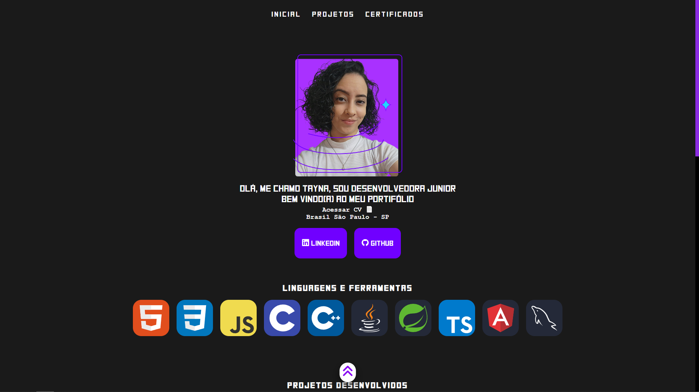
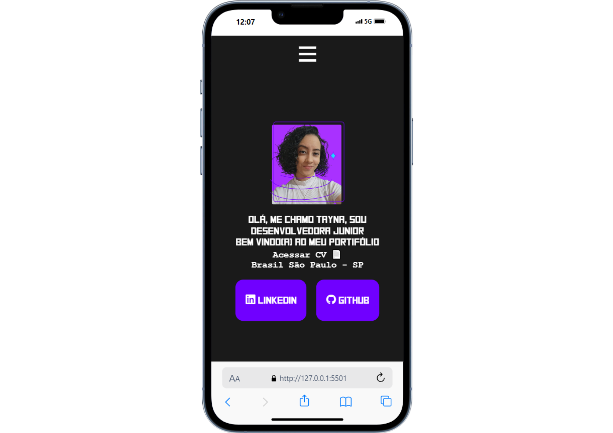

<h1 align="center" style="font-weight: bold;">Portifólio Tayna Simões ANTIGO 👩🏻‍💻</h1>

  
  
  
  

🔗 ACESSE O PROJETO ATUAL: <a target="_blank" href="https://github.com/Tayna0202/Portifolio_ATUAL">Link do Portifólio</a>

## 📌 Sobre o projeto

Projeto de portifólio próprio, ao entrar poderá conhecer um pouco sobre mim e meus projetos desenvovlidos

Acesse aqui ➡ <a target="_blank" href="https://taynaportifolio.vercel.app/">Link do Portifólio</a>

  
  

